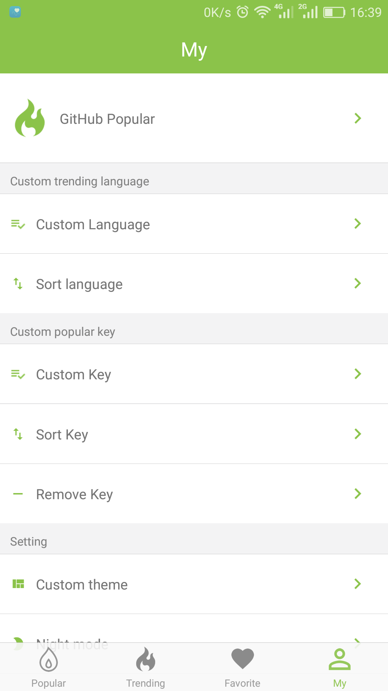

# GithubRN

### 简介

```

基于Flutter开发，适配Android与IOS。项目的目的是为方便个人日常维护和查阅Github,项目同时适合RN的练手学习，覆盖了各种框架的使用，与原生的交互等。

```


### 编译运行流程

1. 配置好react native开发环境
2. clone代码，根目录下执行npm install安装node_modules


### 模块

#### 最热模块
* Redux+FlatList实现列表页数据加载
* 异步action与数据流
* 自定义组件实现列表Item
* action调用页面进行交互
* FlatList的高级应用与加载更多的优化


#### 收藏模块
* 基于多数据存储设计思想实现FavoriteDao
* 为最热与趋势模块添加收藏与取消收藏的功能
* 妙用callback解决Item跨组件更新问题
* 基于最新React标准封装组件
* 封装BaseItem并通过继承的方式进行代码复用


#### 趋势模块
* 优化TabNavigator的效率
* 封装自定义组件
* 基于Modal实现自定义弹框
* 最大程度的进行代码封装与复用
* WebView的使用与封装并实详情页


#### 网络编程与数据存储技术
* 网络编程
* 数据库编程
* Fetch、AsyncStorage封装和使用
* RN项目的网络框架的分层设计
* 离线缓存框架的设计与实现


#### 打包发布与CodePush热更新
* 使用CodePush进行热更新
* 项目发布与部署
* CodePush更新策略与调试
* 打包发布React Native Android应用
* 打包发布React Native iOS应用

### 示例

部分页面效果图:

<figure class="half">




</figure>


